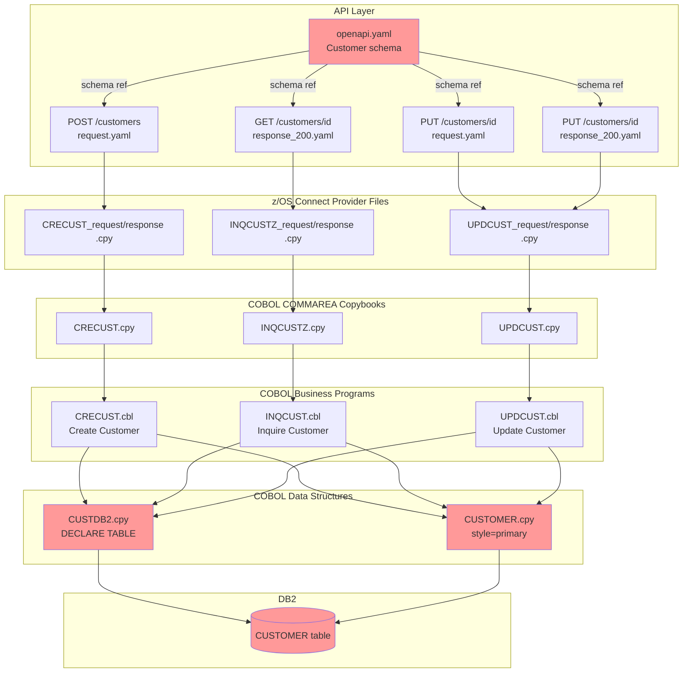
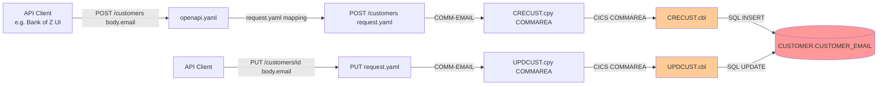
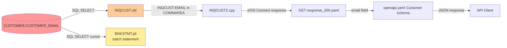
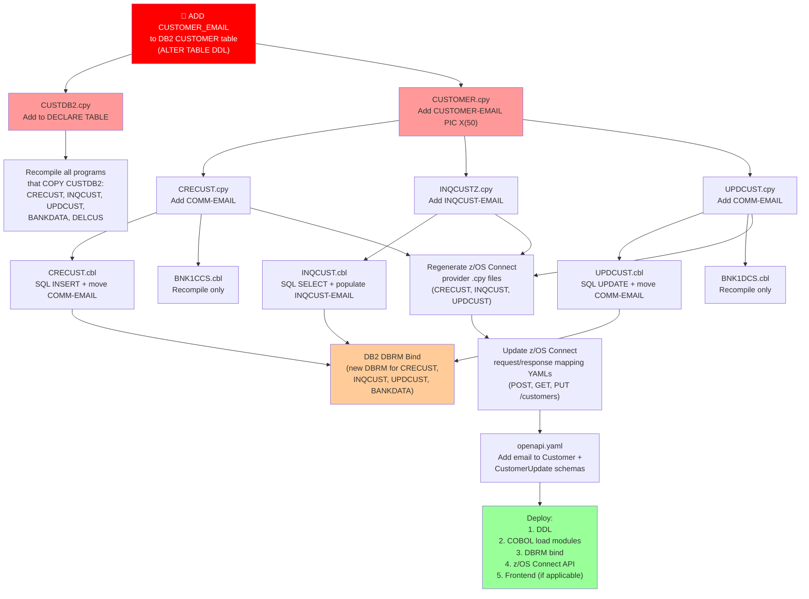

# Impact Analysis Report: Add Email Address Field to Customer Data Model

**Created**: 2026-07-27T22:54:50Z (revised)
**Author**: IBM Bob Premium Package for Z AI Assistant
**Analysis Method**: Z Understand + Local Workspace
**Workspace Alignment**: Fully Aligned
**Confidence Level**: High

---

## 1. Change Summary

### Change Specification

**Title**: Add Email Address Field to Customer Data Model  
**Type**: Enhancement  
**Description**: Add a `CUSTOMER_EMAIL` column (CHAR(50)) to the `CUSTOMER` DB2 table and propagate the new field through all layers of the CICS processing path — COBOL copybooks, COBOL programs, z/OS Connect COMMAREA definitions, z/OS Connect request/response mappings, and the OpenAPI specification.  
**Business Objective**: Capture and expose customer email addresses to support digital communications, notifications, and API consumers.  
**Scope Decision**: CICS path only. The IMS path uses a separate, smaller customer model (IMS DBD/PCB) that does not include comparable demographic fields and is out of scope for this change.  
**DB2 Schema**: Owned by this team — DDL will be executed directly.

### System Context

**Key Technologies**: IBM Enterprise COBOL for z/OS, DB2 for z/OS, CICS, z/OS Connect, OpenAPI 3.0  
**Entry Points**: `CUSTOMER` DB2 table → `CUSTDB2.cpy` (DECLARE TABLE) → `CUSTOMER.cpy` (COBOL struct) → CICS business programs → COMMAREA copybooks → z/OS Connect zosAssets → OpenAPI schema  
**IMS Path**: No changes required (CICS-only scope confirmed)

---

## 2. Scope Definition

### In Scope

| Layer | Artifact | Change |
|---|---|---|
| DB2 schema | `CUSTOMER` table | Add `CUSTOMER_EMAIL CHAR(50)` column |
| COBOL struct copybook | `src/base/cics/copy/CUSTOMER.cpy` | Add `CUSTOMER-EMAIL PIC X(50)` |
| DB2 DECLARE TABLE copybook | `src/base/cics/copy/CUSTDB2.cpy` | Add `CUSTOMER_EMAIL CHAR(50)` to declaration |
| CICS COMMAREA — create | `src/base/cics/copy/CRECUST.cpy` | Add `COMM-EMAIL PIC X(50)` |
| CICS COMMAREA — inquire | `src/base/cics/copy/INQCUSTZ.cpy` | Add `INQCUST-EMAIL PIC X(50)` |
| CICS COMMAREA — update | `src/base/cics/copy/UPDCUST.cpy` | Add `COMM-EMAIL PIC X(50)` |
| CICS COMMAREA — delete | `src/base/cics/copy/DELCUS.cpy` | No change (delete uses customer number only) |
| COBOL business program | `src/base/cics/cobol/CRECUST.cbl` | Accept email in COMMAREA; include in SQL INSERT |
| COBOL business program | `src/base/cics/cobol/INQCUST.cbl` | Include email in SQL SELECT; return in COMMAREA |
| COBOL business program | `src/base/cics/cobol/UPDCUST.cbl` | Accept email in COMMAREA; include in SQL UPDATE |
| COBOL business program | `src/base/cics/cobol/DELCUS.cbl` | No change (delete by customer number) |
| COBOL data loader | `src/base/cics/cobol/BANKDATA.cbl` | Add email to test-data INSERT statements |
| PL/I batch program | `src/base/batch/pli/BNKSTMT.pli` | Optionally include email in statement output (see note) |
| **BMS map — create customer** | **`src/base/cics/bms/BNK1CCM.bms`** | **Add `EMAIL` DFHMDF field at row 21 (UNPROT, input)** |
| **BMS map — display customer** | **`src/base/cics/bms/BNK1DCM.bms`** | **Add `CUSTEML` DFHMDF field at row 20 (PROT, display)** |
| **CICS presentation program — create** | **`src/base/cics/cobol/BNK1CCS.cbl`** | **Add `SUBPGM-EMAIL PIC X(50)` to local SUBPGM-PARMS struct; read `EMAILI` from map; move to SUBPGM-EMAIL before LINK to CRECUST** |
| **CICS presentation program — display** | **`src/base/cics/cobol/BNK1DCS.cbl`** | **Add `COMM-EMAIL PIC X(50)` to inline DFHCOMMAREA LINKAGE and WS-COMM-AREA; display email from INQCUST response; pass email in UPDCUST COMMAREA** |
| z/OS Connect provider CPY — CRECUST | `src/api/src/main/zosAssets/CRECUST/providerFiles/gen/CRECUST_request_0.cpy` | Regenerate to include email |
| z/OS Connect provider CPY — CRECUST | `src/api/src/main/zosAssets/CRECUST/providerFiles/gen/CRECUST_response_0.cpy` | Regenerate to include email |
| z/OS Connect provider CPY — INQCUST | `src/api/src/main/zosAssets/INQCUST/providerFiles/gen/INQCUSTZ_request_0.cpy` | Regenerate to include email |
| z/OS Connect provider CPY — INQCUST | `src/api/src/main/zosAssets/INQCUST/providerFiles/gen/INQCUSTZ_response_0.cpy` | Regenerate to include email |
| z/OS Connect provider CPY — UPDCUST | `src/api/src/main/zosAssets/UPDCUST/providerFiles/gen/UPDCUST_request_0.cpy` | Regenerate to include email |
| z/OS Connect provider CPY — UPDCUST | `src/api/src/main/zosAssets/UPDCUST/providerFiles/gen/UPDCUST_response_0.cpy` | Regenerate to include email |
| z/OS Connect request mapping — POST /customers | `src/api/src/main/operations/%2Fcustomers/post/request.yaml` | Map `$body.email` → `COMM-EMAIL` |
| z/OS Connect response mapping — POST /customers | `src/api/src/main/operations/%2Fcustomers/post/response_201.yaml` | No change (returns only customerId + sortCode) |
| z/OS Connect request mapping — PUT /customers/{id} | `src/api/src/main/operations/%2Fcustomers%2F%7BcustomerId%7D/put/request.yaml` | Map `$body.email` → `COMM-EMAIL` |
| z/OS Connect response mapping — PUT /customers/{id} | `src/api/src/main/operations/%2Fcustomers%2F%7BcustomerId%7D/put/response_200.yaml` | Map `COMM-EMAIL` → `email` |
| z/OS Connect response mapping — GET /customers/{id} | `src/api/src/main/operations/%2Fcustomers%2F%7BcustomerId%7D/get/response_200.yaml` | Map `INQCUST-EMAIL` → `email` |
| OpenAPI specification | `src/api/src/main/api/openapi.yaml` | Add `email` field to `Customer` and `CustomerUpdate` schemas |

### Out of Scope

| Artifact | Reason |
|---|---|
| All IMS path programs (`IBGCUDAT`, `IBSCUDAT`, `IBLOGIN`, `IBLOGIN1`, `IBLOGOUT`, `IBTRAN`) | IMS path uses a separate customer model — excluded by design decision |
| IMS z/OS Connect operations (`/ims/customers/*`) | IMS path excluded |
| IMS DBD/PSB Assembler sources | IMS path excluded |
| `DELCUS.cbl` / `DELCUS.cpy` | Delete operation works by customer number only; email is not involved |
| Credit agency stubs `CRDTAGY1`–`CRDTAGY5` | These only use `SORTCODE.cpy`; no customer data struct |
| `ABNDPROC.cbl` | Error handler; no customer data |

### System Boundaries

- **External boundary**: The OpenAPI `Customer` schema exposed by z/OS Connect is the outermost boundary — API consumers will see the new `email` field
- **IMS boundary**: No change crosses into the IMS processing path
- **DB2 boundary**: Only the `CUSTOMER` table changes; `ACCOUNT`, `PROCTRAN`, and `STTESTER.CONTROL` are unaffected

---

## 3. System Overview

### System Context Diagram



**Legend**: 🔴 Red = primary change origin points that propagate to all other layers

---

## 4. Dependency Analysis

### The Customer Data Model — Current State

The customer data is represented by **three parallel structures** that must all be updated:

| Structure | File | Used for |
|---|---|---|
| `CUSTOMER-RECORD` (03 group) | `src/base/cics/copy/CUSTOMER.cpy` | Internal COBOL working storage in `CRECUST`, `INQCUST`, `UPDCUST` |
| `EXEC SQL DECLARE CUSTOMER TABLE` | `src/base/cics/copy/CUSTDB2.cpy` | Tells the DB2 pre-compiler the table shape — must match the real table |
| `COMM-*` / `INQCUST-*` COMMAREA fields | `CRECUST.cpy`, `INQCUSTZ.cpy`, `UPDCUST.cpy` | Data contract between z/OS Connect and each CICS business program |

All three are independent copybooks. A change to one does **not** automatically update the others — each must be edited explicitly.

### Upstream Dependencies (What feeds the email field in)



### Downstream Dependencies (What reads the email field out)



> ⚠️ **`BNKSTMT.pli` note**: The PL/I batch statement program selects from `CUSTOMER` via a DB2 cursor into the `HV_CUSTOMER` host variable structure. The `SELECT` statement currently uses specific column names (verified in source). Adding `CUSTOMER_EMAIL` to the table does **not** break `BNKSTMT` if the SELECT uses named columns and does not include `CUSTOMER_EMAIL`. However, if `BNKSTMT` is later enhanced to print email on statements, `HV_CUSTOMER` in `BNKSTMT.pli` must also gain a `HV_CUST_EMAIL CHAR(50)` member.

### Internal Dependencies — Copybook Usage by Program

| Copybook changed | Programs that COPY it | Action required |
|---|---|---|
| `CUSTOMER.cpy` | `CRECUST.cbl`, `INQCUST.cbl`, `UPDCUST.cbl`, `BANKDATA.cbl`, `DELCUS.cbl` | All must be recompiled; `CRECUST`, `INQCUST`, `UPDCUST` need SQL logic changes; `DELCUS` recompile only (no logic change); `BANKDATA` needs new email value in INSERT |
| `CUSTDB2.cpy` | `CRECUST.cbl`, `INQCUST.cbl`, `UPDCUST.cbl`, `BANKDATA.cbl`, `DELCUS.cbl` | Recompile all — the DB2 pre-compiler reads this declaration |
| `CRECUST.cpy` | `CRECUST.cbl`, `BNK1CCS.cbl` (CICS presentation layer) | `CRECUST.cbl` needs logic changes; `BNK1CCS.cbl` recompile only (passes COMMAREA through; does not inspect email) |
| `INQCUSTZ.cpy` | `INQCUST.cbl` | Logic change to populate `INQCUST-EMAIL` |
| `UPDCUST.cpy` | `UPDCUST.cbl`, `BNK1DCS.cbl` (CICS presentation layer) | `UPDCUST.cbl` needs logic changes; `BNK1DCS.cbl` recompile only |

---

## 5. Impact Analysis

### Code-Level Impact — Detailed Changes Required

#### 1. DB2 Schema — `CUSTOMER` table
**Impact**: Execute DDL  
```sql
ALTER TABLE CUSTOMER
  ADD COLUMN CUSTOMER_EMAIL CHAR(50);
```
Existing rows will have `CUSTOMER_EMAIL = NULL`. The column should be nullable (no NOT NULL constraint) to avoid breaking existing data.

---

#### 2. `src/base/cics/copy/CUSTDB2.cpy` — DB2 DECLARE TABLE
**Impact**: Add one line to the EXEC SQL DECLARE block.  
Add after `CUSTOMER_CS_REVIEW_DATE INTEGER )`:
```cobol
               CUSTOMER_EMAIL                 CHAR(50) )
```
*(Remove the closing `)` from the previous last line and add it after the new field.)*

---

#### 3. `src/base/cics/copy/CUSTOMER.cpy` — COBOL struct
**Impact**: Add one field after `CUSTOMER-CS-REVIEW-DATE` group:
```cobol
               05 CUSTOMER-EMAIL                       PIC X(50).
```

---

#### 4. `src/base/cics/copy/CRECUST.cpy` — Create customer COMMAREA
**Impact**: Add after `COMM-CS-REVIEW-DATE` group (before `COMM-SUCCESS`):
```cobol
           03 COMM-EMAIL                      PIC X(50).
```

---

#### 5. `src/base/cics/copy/INQCUSTZ.cpy` — Inquire customer COMMAREA
**Impact**: Add after `INQCUST-CS-REVIEW-DT` group (before `INQCUST-INQ-SUCCESS`):
```cobol
           03 INQCUST-EMAIL                   PIC X(50).
```

---

#### 6. `src/base/cics/copy/UPDCUST.cpy` — Update customer COMMAREA
**Impact**: Add after `COMM-CS-REVIEW-DATE` group (before `COMM-UPD-SUCCESS`):
```cobol
           03 COMM-EMAIL                      PIC X(50).
```

---

#### 7. `src/base/cics/cobol/CRECUST.cbl` — Create customer program
**Impact**: Modify SQL INSERT to include the new column:
- In WORKING-STORAGE: `CUSTOMER-EMAIL` is already available via `COPY CUSTOMER` (after copybook change)
- Move `COMM-EMAIL` → `CUSTOMER-EMAIL` before the INSERT
- Add `CUSTOMER_EMAIL` to the `INSERT INTO CUSTOMER` column list and `:CUSTOMER-EMAIL` to the VALUES list

---

#### 8. `src/base/cics/cobol/INQCUST.cbl` — Inquire customer program
**Impact**:
- Add `CUSTOMER_EMAIL` to the `SELECT` column list in the `EXEC SQL SELECT` statement
- Move `CUSTOMER-EMAIL` → `INQCUST-EMAIL` in the COMMAREA response population

---

#### 9. `src/base/cics/cobol/UPDCUST.cbl` — Update customer program
**Impact**:
- Move `COMM-EMAIL` → `CUSTOMER-EMAIL` before the UPDATE
- Add `CUSTOMER_EMAIL = :CUSTOMER-EMAIL` to the `SET` clause in the `EXEC SQL UPDATE` statement

---

#### 10. `src/base/cics/cobol/BANKDATA.cbl` — Test data loader
**Impact**: Add `CUSTOMER_EMAIL` to each `INSERT INTO CUSTOMER` statement in the test data section. Supply a test email value (e.g. `'test@bankofz.example.com'`).

---

#### 11. `src/base/cics/cobol/DELCUS.cbl` — Delete customer program
**Impact**: Recompile only. `DELCUS` uses `COPY CUSTOMER` and `COPY CUSTDB2` but only operates by customer number. No logic change needed.

---

#### 12. z/OS Connect provider `.cpy` files — Regenerate (do NOT hand-edit)
The files under `src/api/src/main/zosAssets/*/providerFiles/gen/` are **auto-generated** from the COMMAREA copybooks by the z/OS Connect CLI. After the COMMAREA copybooks are updated and programs are rebuilt on z/OS, regenerate these files using the z/OS Connect tooling. Files affected:
- `CRECUST/providerFiles/gen/CRECUST_request_0.cpy`
- `CRECUST/providerFiles/gen/CRECUST_response_0.cpy`
- `INQCUST/providerFiles/gen/INQCUSTZ_request_0.cpy`
- `INQCUST/providerFiles/gen/INQCUSTZ_response_0.cpy`
- `UPDCUST/providerFiles/gen/UPDCUST_request_0.cpy`
- `UPDCUST/providerFiles/gen/UPDCUST_response_0.cpy`

---

#### 13. z/OS Connect request/response mapping YAMLs

**`POST /customers` — `request.yaml`**: Add mapping:
```yaml
        - COMM-EMAIL:
            required: false
            nullable: true
            template: "{{$body.email}}"
```

**`PUT /customers/{id}` — `request.yaml`**: Add mapping:
```yaml
        - COMM-EMAIL:
            required: false
            nullable: true
            template: "{{$body.email}}"
```

**`GET /customers/{id}` — `response_200.yaml`**: Add mapping:
```yaml
    - email:
        required: false
        nullable: true
        template: "{{$zosAssetResponse.commarea.INQCUSTZ.\"INQCUST-EMAIL\"}}"
```

**`PUT /customers/{id}` — `response_200.yaml`**: Add mapping:
```yaml
    - email:
        required: false
        nullable: true
        template: "{{$zosAssetResponse.commarea.UPDCUST.\"COMM-EMAIL\"}}"
```

---

#### 14. `src/api/src/main/api/openapi.yaml` — OpenAPI schema
Add `email` to the `Customer` and `CustomerUpdate` component schemas:
```yaml
      email:
        type: string
        maxLength: 50
        description: Customer email address
        example: "customer@example.com"
```

---

### Application-Level Impact

#### COMMAREA size change
Each of the three COMMAREA copybooks (`CRECUST.cpy`, `INQCUSTZ.cpy`, `UPDCUST.cpy`) grows by 50 bytes. CICS COMMAREA length is specified in the `EXEC CICS LINK` / `EXEC CICS RETURN` calls in the calling programs (`BNK1CCS`, `BNK1DCS`, `BNK1CRA` etc.). Review `DFHCOMMAREA` length values in the presentation-layer programs to confirm they use `LENGTH OF DFHCOMMAREA` dynamically (common pattern) rather than hard-coded lengths. If hard-coded, those values must be updated too.

#### Programs requiring recompile (all CICS path)

| Program | Logic change? | Reason |
|---|---|---|
| `CRECUST.cbl` | ✅ Yes | SQL INSERT + COMMAREA |
| `INQCUST.cbl` | ✅ Yes | SQL SELECT + COMMAREA |
| `UPDCUST.cbl` | ✅ Yes | SQL UPDATE + COMMAREA |
| `BANKDATA.cbl` | ✅ Yes | Test data INSERT |
| `DELCUS.cbl` | ❌ Recompile only | Uses `COPY CUSTDB2` |
| `BNK1CCS.cbl` | ❌ Recompile only | COPY of `CRECUST.cpy` (passes COMMAREA through) |
| `BNK1DCS.cbl` | ❌ Recompile only | COPY of `UPDCUST.cpy` (passes COMMAREA through) |

#### DB2 DBRM bind
After recompiling `CRECUST`, `INQCUST`, `UPDCUST`, and `BANKDATA`, new DBRMs are produced. These must be bound into the DB2 plan before the programs can run. This is part of the normal DBB pipeline.

---

### System-Level Impact

#### z/OS Connect API contract change
The `Customer` schema in `openapi.yaml` gains an optional `email` field. This is a **backward-compatible additive change** — existing API consumers that ignore unknown fields are unaffected. Consumers that validate strictly against the schema must update their validation.

#### `BNKSTMT.pli` — Batch monthly statement
The PL/I SELECT uses named columns (`HV_CUST_*`). Adding `CUSTOMER_EMAIL` to the table does not affect existing queries that do not reference it. **No change to `BNKSTMT.pli` is required for this scope.** If email is desired on printed statements in future, `BNKSTMT.pli` and its host variable struct (`HV_CUSTOMER`) would need a separate change.

---

## 6. Change Propagation Map



### Deployment Sequence (order is critical)

1. **DB2 DDL** — `ALTER TABLE CUSTOMER ADD COLUMN CUSTOMER_EMAIL CHAR(50)` (nullable, no default)
2. **Build COBOL programs** — DBB impact build picks up copybook changes automatically via `dbb-app.yaml` dependency patterns
3. **DB2 DBRM bind** — bind new DBRMs for `CRECUST`, `INQCUST`, `UPDCUST`, `BANKDATA` into the DB2 plan
4. **Regenerate z/OS Connect provider `.cpy` files** — using z/OS Connect CLI after programs are live on z/OS
5. **Update z/OS Connect mapping YAMLs** — add email mappings
6. **Rebuild z/OS Connect API** — `dbb build impact` picks up the `openapi.yaml` and mapping YAML changes
7. **Deploy z/OS Connect API** — Wazi Deploy deploys the new API artifact

> ⚠️ **Critical ordering**: Steps 1 (DDL) and 3 (DBRM bind) must complete before running any program that accesses `CUSTOMER_EMAIL`. The DB2 plan must be re-bound after DDL to allow programs to reference the new column.

---

## 7. Risk Assessment

| ID | Risk | Category | Likelihood | Impact | Level | Mitigation |
|---|---|---|---|---|---|---|
| R1 | **`BNK1DCS.cbl` inline `DFHCOMMAREA` LINKAGE (lines 191–212) and `WS-COMM-AREA` (lines 128–150) are hard-coded field-by-field — NOT COPY statements — and will silently corrupt all customer data if not manually extended** | Regression | **High** | **High** | **CRITICAL** | Manually add `COMM-EMAIL PIC X(50)` to LINKAGE and `WS-COMM-EMAIL PIC X(50)` to WS-COMM-AREA; add display and update logic |
| R1b | BMS reassembly must precede `BNK1CCS`/`BNK1DCS` recompile — if order is wrong, compile fails on undefined map field names | Build Failure | Medium | Medium | **MEDIUM** | DBB `dbb-app.yaml` `.bms` dependency pattern handles this; verify in build log |
| R2 | DBRM bind forgotten or run before DDL — programs abend with SQL -204 (object not found) | Runtime Failure | Medium | High | **HIGH** | Enforce deployment sequence; test in non-prod first |
| R3 | z/OS Connect provider `.cpy` files hand-edited instead of regenerated — causes silent data corruption | Data Integrity | Medium | High | **HIGH** | These files are in `gen/` subdirectory — always regenerate via z/OS Connect CLI; add note to implementation plan |
| R4 | Existing CUSTOMER rows have NULL email — programs that move `CUSTOMER-EMAIL` to display fields may show blanks or SPACES rather than fail, but callers must handle null/blank gracefully | Data Integrity | High | Low | **MEDIUM** | Ensure no NOT NULL constraint on `CUSTOMER_EMAIL`; verify COBOL programs initialise the field to SPACES before SELECT |
| R5 | `BANKDATA.cbl` INSERT fails if email column added to table but not to the INSERT column list | Runtime Failure | High | Medium | **MEDIUM** | Update `BANKDATA` INSERT simultaneously with DDL deployment |
| R6 | OpenAPI schema change breaks strict-validation API consumers | Integration | Low | Medium | **LOW** | Email field is optional (`required: false`, nullable); additive — backward compatible for lenient consumers |
| R7 | `BNKSTMT.pli` SELECT uses `SELECT *` style — verify it uses named columns | Data Integrity | Low | Low | **LOW** | Confirmed: `BNKSTMT.pli` uses named columns in SELECT (verified in source); no risk |

### Critical Risk Detail — R1: COMMAREA length

The presentation-layer programs `BNK1CCS.cbl` (create customer) and `BNK1DCS.cbl` (delete customer — actually update customer screen) pass the COMMAREA to `CRECUST` and `UPDCUST` respectively via `EXEC CICS LINK PROGRAM(...) COMMAREA(...) LENGTH(...)`. If `LENGTH` is specified as a numeric literal rather than `LENGTH OF DFHCOMMAREA`, the truncated COMMAREA will silently drop the new email field. This must be verified before implementation.

---

## 8. Assumptions and Unknowns

| # | Assumption / Unknown | Status |
|---|---|---|
| A1 | `BNK1CCS.cbl` and `BNK1DCS.cbl` use dynamic COMMAREA length (`LENGTH OF DFHCOMMAREA`) | **Assumed — verify before implementing** |
| A2 | No other application (e.g. Data Warehouse, external ETL) reads the `CUSTOMER` table directly and will break on a new nullable column | Confirmed by user (CICS team owns DB2 schema) |
| A3 | Email field is optional (nullable) — not required for existing customer records | Confirmed — user approved nullable column |
| A4 | The z/OS Connect API `Customer` schema is defined in `openapi.yaml` under `components/schemas/Customer` | Confirmed from file inspection |
| A5 | `BNKSTMT.pli` batch does not need to output email on statements in this scope | Confirmed by user (CICS-only, no batch requirement stated) |

---

## 9. Effort Estimate

| Work Item | Effort |
|---|---|
| DB2 DDL | < 0.5 day |
| COBOL copybook edits (6 files × simple additions) | 0.5 day |
| COBOL program logic changes (`CRECUST`, `INQCUST`, `UPDCUST`, `BANKDATA`) | 1–2 days |
| z/OS Connect provider file regeneration | 0.5 day |
| z/OS Connect mapping YAML updates (4 files) | 0.5 day |
| OpenAPI schema update | 0.25 day |
| DBB build + DBRM bind + deployment | 0.5 day |
| Testing (unit + integration + API) | 1–2 days |
| **Total** | **~5–7 days** |

---

## 10. Recommended Next Steps

1. **Verify COMMAREA lengths** in `BNK1CCS.cbl` and `BNK1DCS.cbl` (Risk R1 — highest priority gate)
2. **Create implementation plan** using the component list in Section 5 as the work breakdown
3. **Execute DB2 DDL** in non-production first; verify existing programs still run with new nullable column
4. **Implement copybook changes** in the order: `CUSTDB2.cpy` → `CUSTOMER.cpy` → COMMAREA copybooks
5. **Implement COBOL program changes** for `CRECUST`, `INQCUST`, `UPDCUST`, `BANKDATA`
6. **Run DBB impact build** — the `impactQueryPatterns` in `dbb-app.yaml` will automatically detect all programs affected by the copybook changes
7. **Regenerate z/OS Connect provider `.cpy` files** — do not hand-edit
8. **Update mapping YAMLs and OpenAPI spec**
9. **Deploy in sequence** per Section 6 deployment order
